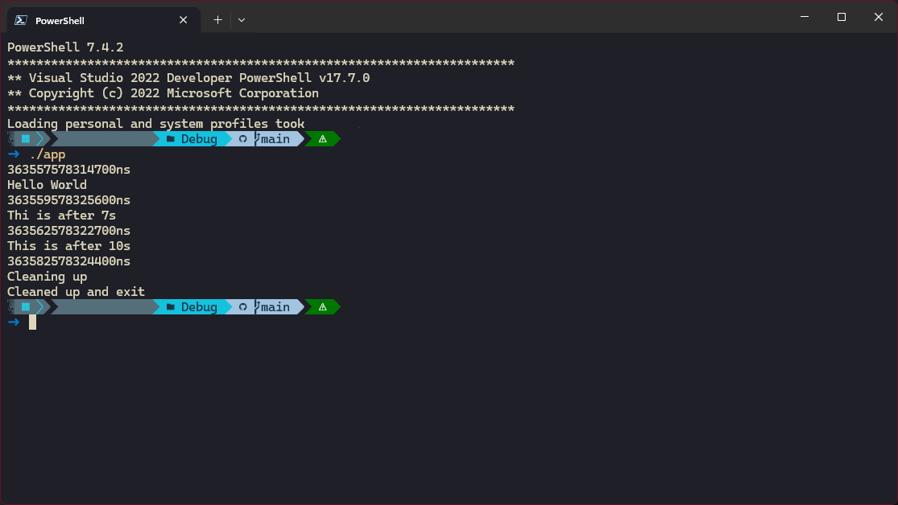

# Simple Scheduler Demo
This project, "Simple Scheduler Demo," is a demonstration of a simple scheduling system inspired by two primary sources:
the scheduler mechanism from Cocos2D and the event loop model of JavaScript, particularly the setTimeout and setInterval
functions.

In many real-time applications, it is crucial to have a system that can efficiently manage the execution of various
tasks at specified intervals or after certain delays. This scheduler implementation aims to provide a straightforward
yet effective way to handle such timed tasks in C++.

## Key Features

1. Singleton Pattern: The scheduler is implemented as a singleton, ensuring there is only one instance managing all
scheduled tasks.
2. Task Scheduling: Tasks can be scheduled to run after a specific delay. This is akin to JavaScript's setTimeout, which
schedules a function to be executed once after a certain period.
3. Task Canceling: Tasks can be canceled after scheduled, by the returned task id.
4. Tick Function: The tick method processes all tasks that are due to be executed, similar to the event loop in
JavaScript, which checks and executes tasks in a loop.

## Implementation Details

- Scheduler Class: The core component of the system, responsible for managing and executing scheduled tasks.
    - schedule(): Adds a task to the scheduler to be executed after a given delay.
    - cancel(): Removed a task which is previously added to the scheduler by the returned id.
    - tick(): Checks for tasks that are due to be executed and runs them.
- Main Loop: In main.cpp, a loop continuously calls the tick function of the scheduler, ensuring tasks are executed at
the appropriate times.

This demo highlights the practical application of task scheduling in C++, drawing parallels to well-known mechanisms in
game development and web programming, providing a foundational tool for real-time task management.

